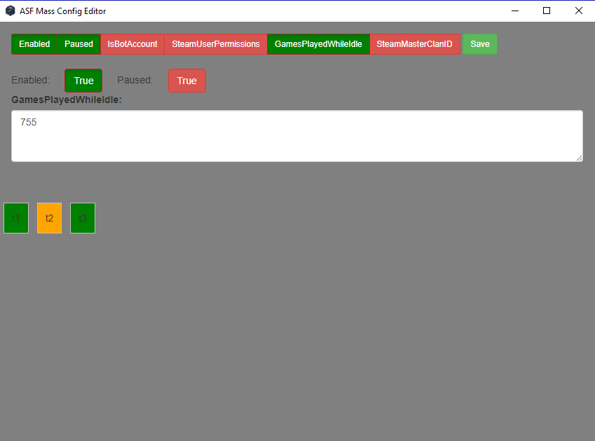

ASF Mass Config Editor is tool to edit same value in multiple json files for https://github.com/JustArchi/ArchiSteamFarm

You can select values which you want to change (curently only 6) and you can also select json files which you wanna ignore.

I am not sure if output data types in json files are correct so use at your own risk.

I am currently not providing binary files so if you want to use this app download nwjs from https://nwjs.io/ and extract files from this repository into nwjs directory.

How to use this app:

On the first row you select values which you want to change ( Enabled, Paused, IsBotAccount, SteamUserPermissions, GamesPlayedWhileIdlem, SteamMasterClanID); only selected (green) values will be changed.

Lower you can edit selected values. Simple values if true is clicked (green) it will be set to true if not (red) it will be set to false.

Other text or number values show the exaples for input.

And last you have your accounts (in this example there are tree: t1, t2, t3)
You can select account which you dont want to edit by clicking on them (orange background color)

Currently you have to put your json files in config_old folder and edited json files will be saved in config_new folder (not ideal solution but safe).

Download link with nwjs-sdk-v0.23.6-win-x64 is here (83mb) https://genesix.eu/project/asf_mass_config_editor/asf_mass_config_editor.zip

And this my first atempt to use git and github so Keep Calm and git gud!
